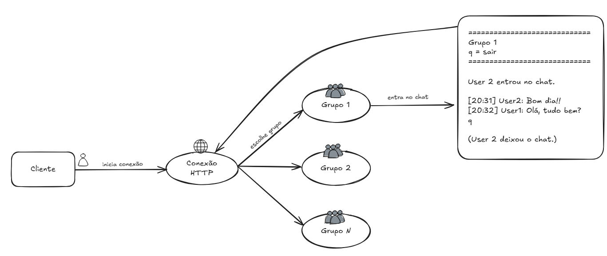
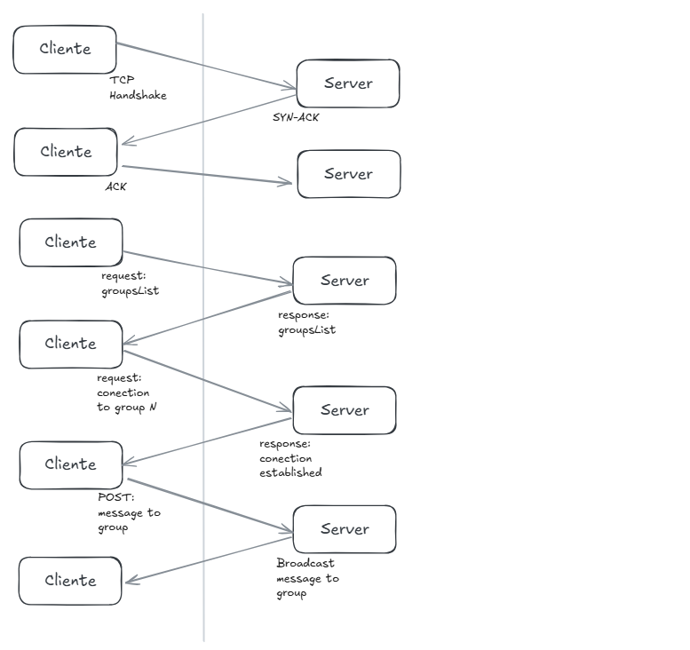

### Arquitetura
---

1. **Servidor:**
    + Contém:
        + Uma lista de **Clientes** conectados, para fim de métricas e controle;
        + Uma lista de **Grupos** (que trabalharão em *threads* separadas);
            - um **grupo** conterá:
                - *chat* entre os usuários; 
                - *usuários conectados*;
                - informações úteis;
    + Haverá um número de grupos fixo, definido por uma constante;
    + Cada **usuário** que estabelecer uma **conexão** receberá essa lista de grupos e poderá escolher um deles para se juntar ao bate-papo ou iniciar um.
 
2. **Cliente**
    + Cada cliente terá *nome* e *endereço* (por enquanto);
    + Ao conectar-se, escolherá um dos grupos para entrar;
    + Tendo entrado no grupo A, o cliente poderá: 
        - **visualizar** informações organizadas sobre o grupo no qual está conectado, no momento
        - **conversar**, em tempo real, com os outros clientes conectados no mesmo grupo.
        ---
 

### Diagramas
---

1. Diagrama de **fluxo do cliente** no serviço:

2. Diagrama de **conexão** entre o cliente e o servidor:
